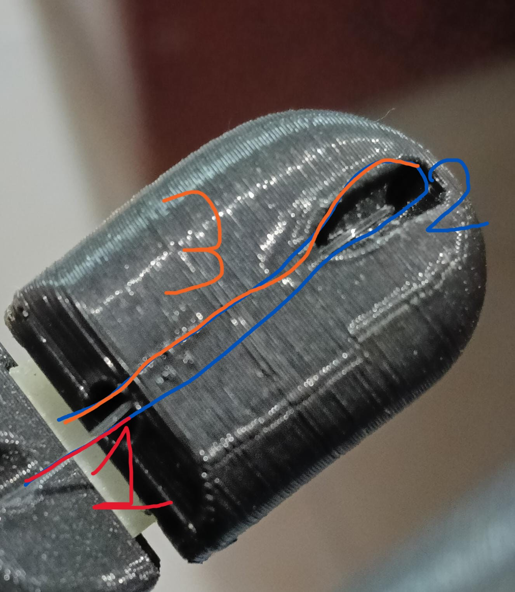
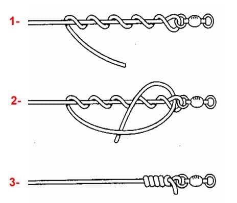
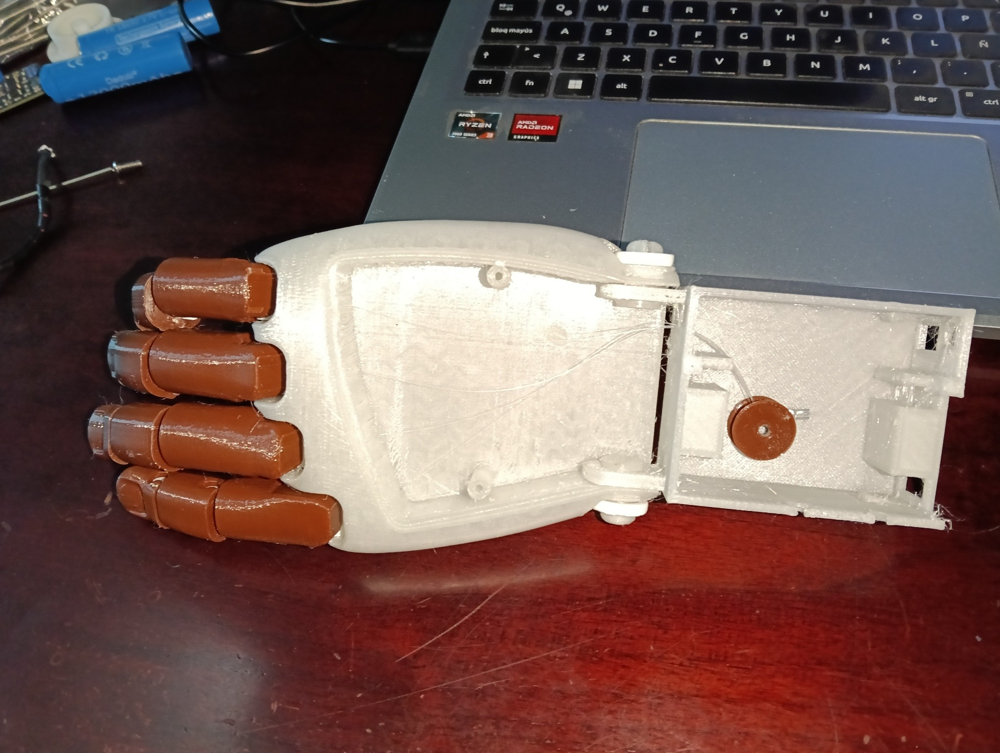
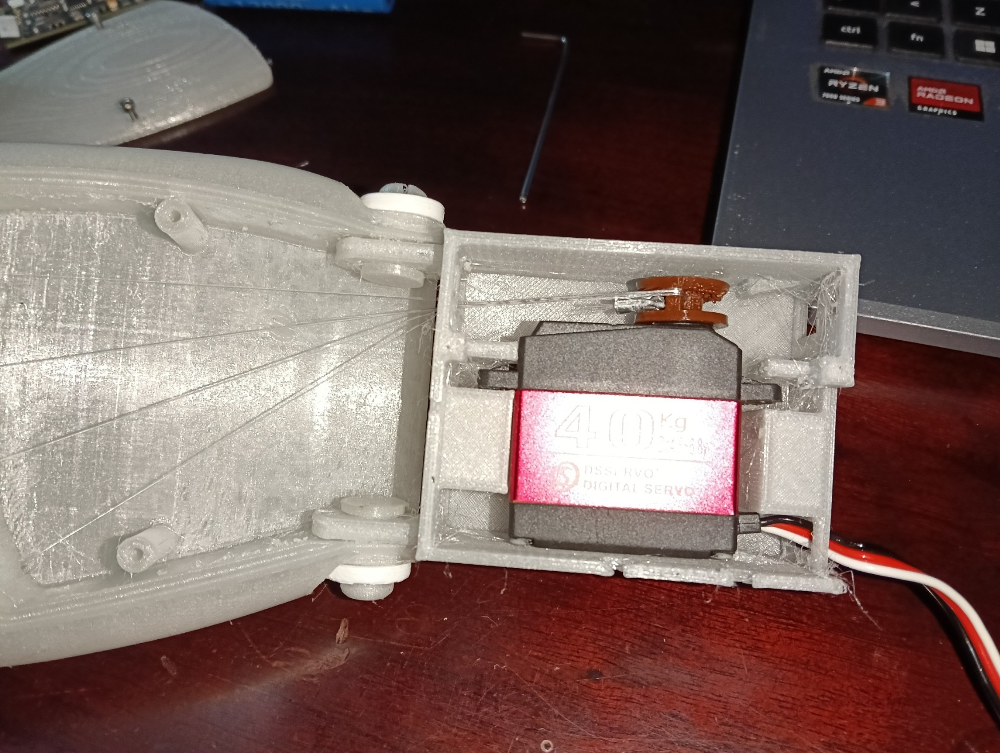
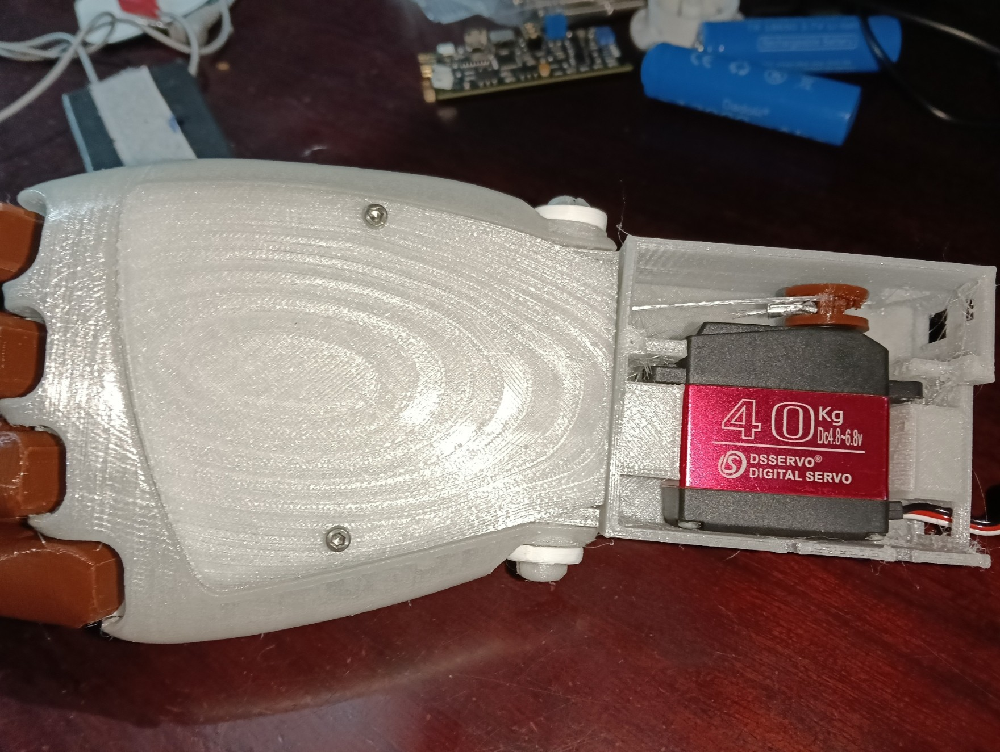
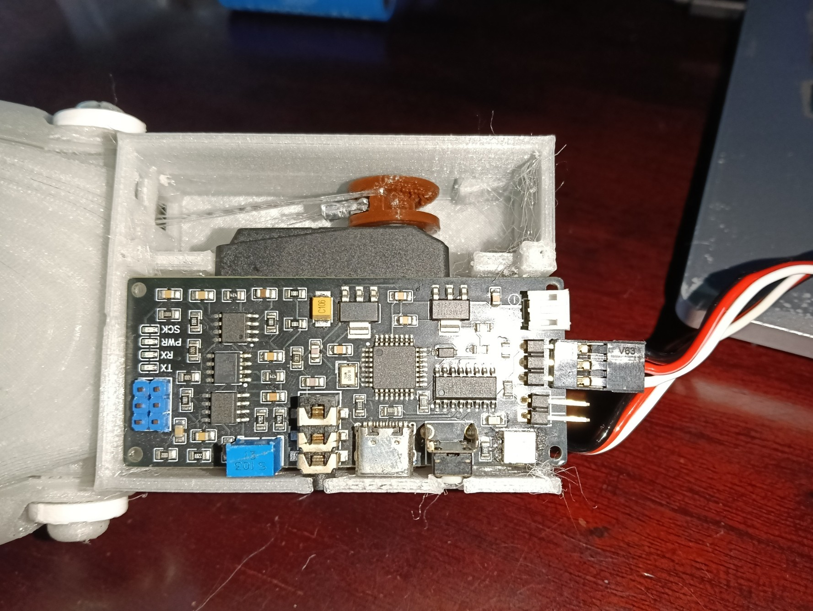
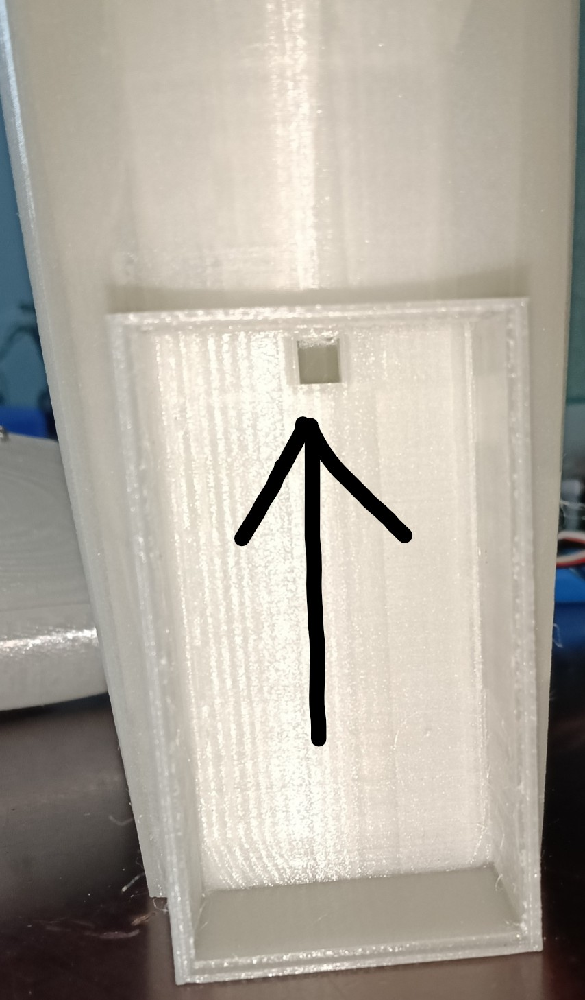
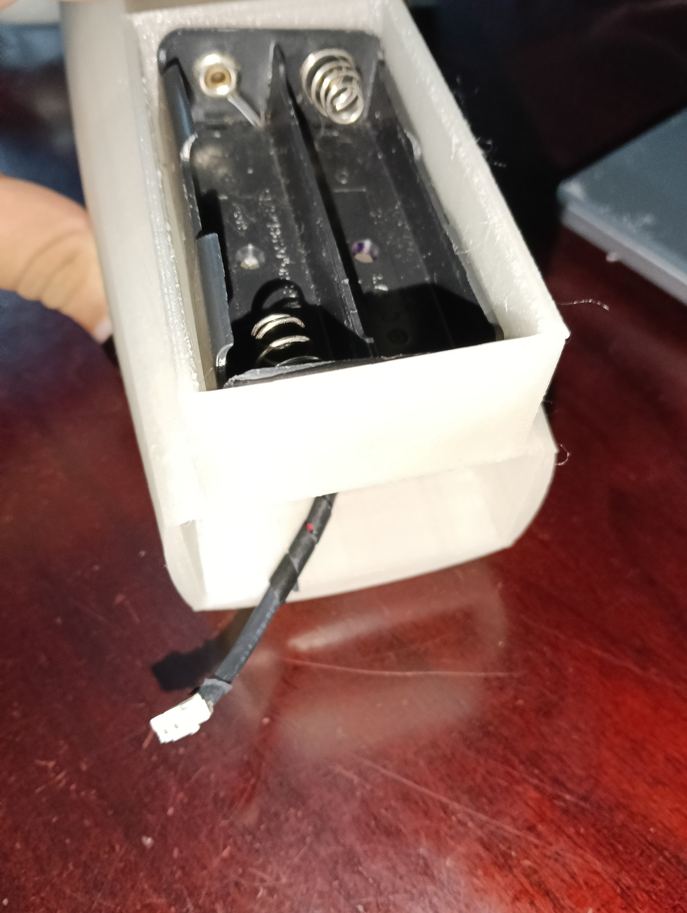
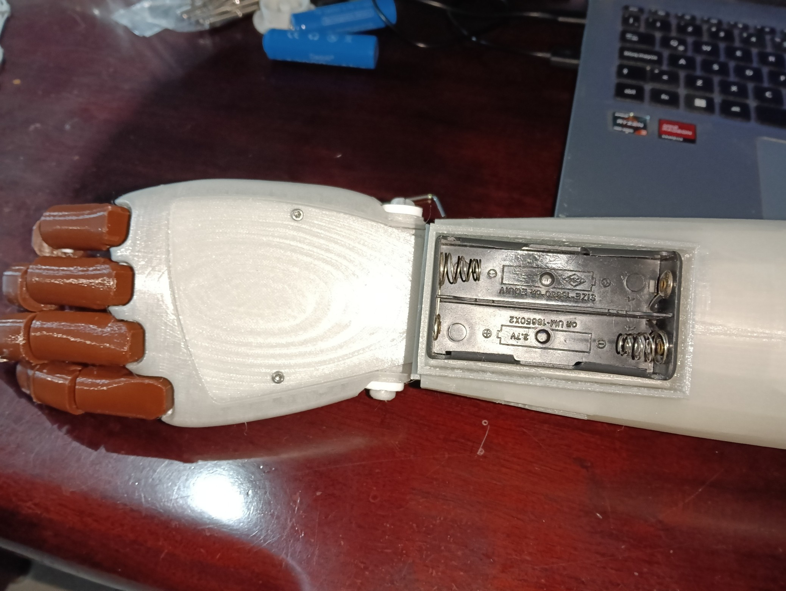
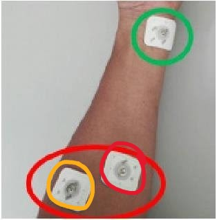

  # Guía de Impresión, Edición y Ensamblado de Prótesis Electromecánica

  **Manual técnico interactivo e instructivo de construcción para la prótesis de mano de *ManitasParaTodo2***

  
  
  

   

  

---

## 📋 Tabla de Contenidos

- [📌 Sobre el Proyecto](#-sobre-el-proyecto)
- [🧩 Estructura de Archivos CAD / 3D](#-estructura-de-archivos-cad--3d)
- [🖨️ Parámetros Recomendados de Impresión 3D](#️-parámetros-recomendados-de-impresión-3d)
- [🛠️ Lista de Materiales y Componentes (BOM)](#️-lista-de-materiales-y-componentes-bom)
- [✏️ Guía de Edición y Modificación CAD](#️-guía-de-edición-y-modificación-cad)
- [⚙️ Paso a Paso: Guía de Ensamblado](#️-paso-a-paso-guía-de-ensamblado)
  - [1. Preparación de Piezas 3D](#1-preparación-de-piezas-3d)
  - [2. Mecanismo de Tensión y Hilos](#2-mecanismo-de-tensión-y-hilos)
  - [3. Ensamble de Carcasa y Electrónica](#3-ensamble-de-carcasa-y-electrónica)
- [🤝 Contribución y Créditos](#-contribución-y-créditos)

---

## 📌 Sobre el Proyecto

Este repositorio contiene el diseño, archivos de modelado 3D y documentación técnica para la fabricación de una **prótesis electromecánica de mano**. El proyecto está concebido para ser modificado, impreso en 3D y ensamblado con componentes estándar de bajo costo.

> 💡 **Nota:** Este manual está estructurado como una guía paso a paso para makers, ingenieros y protesistas que busquen replicar o adaptar el diseño.

---

## 🧩 Estructura de Archivos CAD / 3D

Los modelos 3D de la versión **Electromecanica Final** se encuentran en la carpeta [`Modelos/Electromecanica Final`](./Modelos/Electromecanica%20Final/). Incluye archivos editables de Fusion 360 (`.f3d`), archivos listos para laminar (`.stl`) y archivos completos de ensamble o impresión (`.f3z` y `.3mf`).

### Archivos editables y de ensamble

| Archivo | Tipo | Descripción / Función |
| :--- | :--- | :--- |
| [`Brazo.f3d`](./Modelos/Electromecanica%20Final/Brazo.f3d) | Fusion 360 | Estructura principal de la prótesis. |
| [`Caja de Componentes.f3d`](./Modelos/Electromecanica%20Final/Caja%20de%20Componentes.f3d) | Fusion 360 | Caja para alojar componentes. |
| [`carrete servomotor.f3d`](./Modelos/Electromecanica%20Final/carrete%20servomotor.f3d) | Fusion 360 | Carrete para el mecanismo de tracción del servomotor. |
| [`Clip.f3d`](./Modelos/Electromecanica%20Final/Clip.f3d) | Fusion 360 | Clip de sujeción. |
| [`seguro clip.f3d`](./Modelos/Electromecanica%20Final/seguro%20clip.f3d) | Fusion 360 | Seguro del clip. |
| [`Tapa Pilas.f3d`](./Modelos/Electromecanica%20Final/Tapa%20Pilas.f3d) | Fusion 360 | Tapa del compartimento de pilas. |
| [`ensamble brazo.f3z`](./Modelos/Electromecanica%20Final/ensamble%20brazo.f3z) | Ensamble Fusion 360 | Ensamble del brazo. |
| [`Electromecanica.3mf`](./Modelos/Electromecanica%20Final/Electromecanica.3mf) | Proyecto 3MF | Archivo de proyecto para impresión 3D. |

### Archivos STL para impresión

| Archivo | Pieza |
| :--- | :--- |
| [`Brazo.stl`](./Modelos/Electromecanica%20Final/Brazo.stl) | Brazo |
| [`Caja de Componentes.stl`](./Modelos/Electromecanica%20Final/Caja%20de%20Componentes.stl) | Caja de componentes |
| [`carrete servomotor.stl`](./Modelos/Electromecanica%20Final/carrete%20servomotor.stl) | Carrete del servomotor |
| [`Clip.stl`](./Modelos/Electromecanica%20Final/Clip.stl) | Clip |
| [`seguro clip.stl`](./Modelos/Electromecanica%20Final/seguro%20clip.stl) | Seguro del clip |
| [`Tapa Pilas.stl`](./Modelos/Electromecanica%20Final/Tapa%20Pilas.stl) | Tapa de pilas |
| [`LH_Finger_Plate.stl`](./Modelos/Electromecanica%20Final/LH_Finger_Plate.stl) | Placa de dedos |
| [`Ligamentos de mano.stl`](./Modelos/Electromecanica%20Final/Ligamentos%20de%20mano.stl) | Ligamentos de mano |
| [`Mano V4.stl`](./Modelos/Electromecanica%20Final/Mano%20V4.stl) | Mano, versión 4 |
| [`Tapa Mano.stl`](./Modelos/Electromecanica%20Final/Tapa%20Mano.stl) | Tapa de mano |

---

## 🖨️ Parámetros Recomendados de Impresión 3D

Para asegurar la resistencia mecánica de las articulaciones y carcasas, se sugieren los siguientes parámetros en tu software laminador (Eleego Slicer):

| Parámetro | Valor / Configuración Recomendada |
| :--- | :--- |
| **Material** |  PLA  / TPU (Ligamentos) |
| **Altura de Capa** | 0.20 mm  |
| **Relleno (Infill)** | 25% (Patrón Giroide) 10% Prototipos |
| **Soportes** | Árbol (Organic/Tree) Pendiente Maxima 10|
| **Temperatura Boquilla** | 210 °C (PLA) |
| **Temperatura Cama** |  60 °C (PLA) |

## 🛠️ Lista de Materiales y Componentes (BOM)

### Impresión 3D y Estructura
- Piezas impresas en 3D (`.stl`)
- Hilo multifilamento / Hilo de pescar de alto libraje (Braided Line 50lb+)
- Asegurador de Hilos

### Electrónica y Mecánica
- 1 Servomotor (ds3240mg)
- 1x Placa de control 
- 2x Batería Li-Ion (18650 12000mAh)
- Tornillería M2.5 y M3
- Hilo de Pesca 
- Manga Conectora (Hilos) 

---

## ✏️ Guía de Edición y Modificación CAD

Si necesitas adaptar las medidas a un usuario específico o cambiar la cavidad del muñón/electrónica:

1. Abrir el archivo `.f3d` correspondiente en **Autodesk Fusion 360**.
2. **Ajuste de Escala:** Modifica la escala general del ensamble de la palma y dedos en función del tamaño antropométrico deseado.
3. **Modificación de Carcasa:** En el árbol de operaciones, localiza los bocetos (sketches) del *Enclosure* para ajustar el espacio de baterías o controladores.
4. **Exportar a STL:**
   - Ve a `Archivo` > `Exportar` > Formato `.stl` (o clic derecho en el componente principal > `Guardar como malla`).

---

## ⚙️ Paso a Paso: Guía de Ensamblado

### 1. Preparación de Piezas 3D
- [ ] Retirar soportes cuidadosamente de los agujeros de articulación.
- [ ] Verificar y Remover reciduos de filamento

---

### 2. Mecanismo de Tensión y Hilos
-[ ] Armar los dedos y colocarlos en la mano.

  

-[ ] Pasar los hilos por los orificios de la mano y dedos.

-[ ] La punta de los dedos cuanta con dos canales el inferios y superior, se debe pasar primero por el canal inferior para depues sacarlo por el interior.

  

-[ ] Asegurarse que el nudo quede dentro de los canales del Hilo.
 

  

 ⚠️ **Advertencia:** Verificar los hilos esten bien amarrados y los dedos se muevan correctamente al tirar de los hilos.

---

### 3. Ensamble de Carcasa y Electrónica
-[ ] Unir la Mano con la Caja de Componentes utilizando los clips y seguros de clips
 

  

-[ ] Pasar los hilos por el orificio de la Caja de Componentes.
 

  

-[ ] Pasar los hilos por el orificio del carrete del servomotor pasando de izquierda a derecha , y asegurandose de moner la manga conectora del lado derecho del carrete.
*Nota: la orientacion del carrete se define por el agujero dentado con el cual se une al servomotor, siendo esta la parte de abajo
 

  

-[ ] Al tener listo el carrete se debe de unir al servomotor y asegurarse con un tornillo M3 de 6 mm de longitud.
*Nota: el Servomotor gira hacia la derecha para cerrar la mano y ala izquierda para abrirla.
-[ ] Colocar el servomotor en la caja de componentes de la siguiente manera (el cable debe de pasar por el orificio de la caja):
 

  

-[ ] Atornillar la tapa de la Mano con Tornillos M2.5 de 6mm de longitud(PLanos) para cubrir los hilos.
 

  

-[ ] Situar la tarjeta de control sobre el servomotor y conectar el servo como indica la tarjeta en la parte inferior.

  

-[ ] Para colocar el porta pilas en el brazo se debe de introducir el conector en el agujero dentro del compartimiento del portapilas, para asi tener el conector en el espacio donde ira la caja de componentes.

  
  

-[ ] Conectar el portapilas SIN BATERIAS, a la tarjeta de control e introducir la caja de componentes en el brazo teniendo cuidado con los cables, cuando se escuche un click la caja de componentes estara en posición.

  

-[ ] Conectar los sensores mielectricos a la tarjeta y colocar en el brazo como se muestra en la imagen:

  

-[ ] Insertar Pilas y Probar 

### ¡Has completado la construcción de la Mano Electromecánica!   
🎉🎉🎉

¡El ensamblado, ajuste de tensores y montaje electrónico están listos para ponerse a prueba!

## 🤝 Contribución y Créditos

Este repositorio forma parte del proyecto de estadías e investigación para el desarrollo de prótesis electromecánicas de mano.

### 👤 Autor y Desarrollo
* **Desarrollador Principal:** [Ruben Barrios Luna](https://github.com/RubiBL) - *Modelado 3D, prototipado de carcasas, integración electromecánica y sintonización de mecanismos de tensión.*

### 🏛️ Organización y Agradecimientos
* **ManitasParaTodo2:** Por el apoyo, espacio y recursos proporcionados para llevar a cabo el diseño, pruebas e impresión de los prototipos funcionales.

---

  ¿Encontraste algún problema en la impresión o ensamblado? Abre un <a href="https://github.com/RubiBL/Estadias-ManitasParaTo2/issues">Issue</a> para reportarlo.

